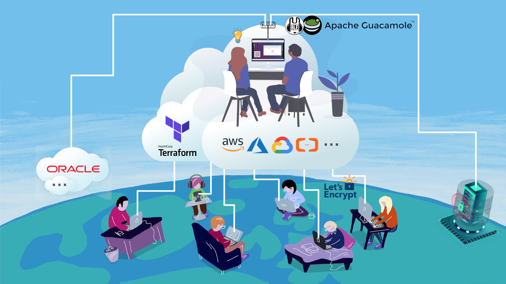

Flexpair is a cloud environment for shoulder-to-shoulder-like remote collaboration of STEM professionals. And it has all the features that this target group values most, like

- reproducibility
- open-source
- clean interface
- scalable compute power

 Because it was tailor-made by experienced data scientists to be enjoyable for their fellow data people.

<dl>
  <dt><strong>to flexpair (verb)</strong></dt>
  <dd>to cowork and innovate across organizations and timezones in a truly hands-on fashion, in particular among STEM professionals</dd>
  <dt><strong>Flexpair (noun)</strong></dt>
  <dd>flexibly scalable and reproducible shared desktop and communication infrastrucure, privacy-friendly and multi-cloud enabled</dd>
</dl>

Test it [here](http://demo.flexpair.com){:target="_blank"} for free and without installation!

The success of data-driven projects hinges on efficiently sharing work packages between coworkers and jointly delivering them to the client.

With more and more companies transitioning into a hybrid work model, we asked ourselves the question: How can we make those frequent handovers more consistent and a truly hands-on experience? 

### Value Proposition

With our novel Flexpair solution, you will have
- the feeling of shoulder-to-shoulder pair programming, even when working remotely
- a unified tool for synchronous and asynchronous collaboration
- zero friction when you need external people like freelancers to join your project ad hoc
- the ability to clone not only the code but the entire shared desktop at the press of a button
- no missing dependencies etc. ever again, even across different cloud providers
- the option to flexibly scale up (and down) your RAM and CPU cores
- minimal latency and bandwidth requirements
- no need for a second or third notebook

Not so fun fact: Did you know that the production of a notebook until you switch it on the first time produces as much CO2 as driving about 1200 km with your car?

### Tech Features

Flexpair is a collection of Terraform modules and cloud-init scripts for deploying a shared cloud desktop (Ubuntu 20.04 LTS) with high quality audio conferencing and self-hosted email inbox to an arbitrary public cloud account. Free tier resources are sufficient and multicloud is actively supported.

- Ubuntu 20.04 LTS with lightweight LXQt desktop
- Requires only 1 GB of RAM (often available for free)
- Infrastructure-as-code powered by Terraform Cloud
- Apache Guacamole for screen and Mumble for audio
- Receive a dedicated subdomain or bring your own
- self-hosted team inbox [subdomain]@flexpair.com
- SSH and TLS certificate for protecting your data
- full control over where your data are stored
- data privacy by locking out data collectors
- zero install, fully runs in your favorite browser

### Other ideas how to use Flexpair

- Virtual creative space for brain storming and technology brokering 🧠💡♻
- Patient-centered healthcare for everyone 🏥👩‍⚕️️🩺🤕🧘📧👩🏾‍🔬‍🧫🔬
- Seamless task delegation to remote assistants 👩🏻‍💼👉🏻✅👂🏼‍🧞‍♂️
- Professional podcast production across the globe 👳🏿‍♂️🎙🎛⟷🎙👨🏻‍🦰🎧

### When not to use Flexpair

The least thing we want is to waste your precious time. Therefore, please do not read any further

- if you really need to give someone remote access to your local machine, please consider using [TeamViewer](https://www.teamviewer.com/en/) or comparable established solutions

In any other case, we would love to have you as our valued customer.

### Mission Statement

To enable effective and human-friendly remote work that contributes to a fair distribution of intellectual property.

### Market Analysis

According to a [press release from Gartner in July 2020](https://www.gartner.com/en/newsroom/press-releases/2020-07-23-gartner-forecasts-worldwide-public-cloud-revenue-to-grow-6point3-percent-in-2020) the market demand for cloud-based desktop-as-a-service (DaaS) will rise to 2.535 billion USD in 2022. This consitutes the Total Addressable Market (TAM) which is, of course, totally unrealistic to achieve with our product in the near future.

We deliberately chose to focus on Linux as our guest operating system for a variety of reasons that software developers in particular will immediately understand. In order to quantify the preference for UNIX-based operating systems over Windows, we analyzed the raw data from [Stack Overflow's 2020 user survey](https://insights.stackoverflow.com/survey/2020) and found that 23.2% of professional developers are already using Linux as their primary desktop, 25.0% were on MacOS and 16.0% were Windows users explicitely stating that they would rather prefer to work on Linux. Extrapolating from the 64462 valid responses to the survey, we are confident to conclude that 64.3% of global pro-developers are affine to UNIX and would dislike being forced to use Windows on a virtual desktop.

But also people working in other sectors like education and media as well as finance value the security and stability of Linux. A whopping 16.9% of all Ubuntu users work in finance according to [21,291 survey responses in April 2020](https://ubuntu.com/blog/ubuntu-20-04-survey-results). These verticals on top of IT add up to a little over 50% of the whole market according to [Marketysers Global Reports And Data](https://www.reportsanddata.com/report-detail/desktop-virtualization-market). Considering that there are some Linux users in the other half of verticals as well, we consider a Servicable Adressable Market (SAM) of around 0.500 x 0,643 x TAM not as an overestimate. For the year 2022 this means we expect 815 million USD or 675 million EUR demand for LINUX-based DaaS solutions.

Finally, the Servicable Obtainable Market (SOM) is likely the small and medium size businesses (about 20% of the market), as the more established [competitors](https://www.g2.com/products/shells-com/competitors/alternatives) catering to large enterprises come with a hefty price tag.

