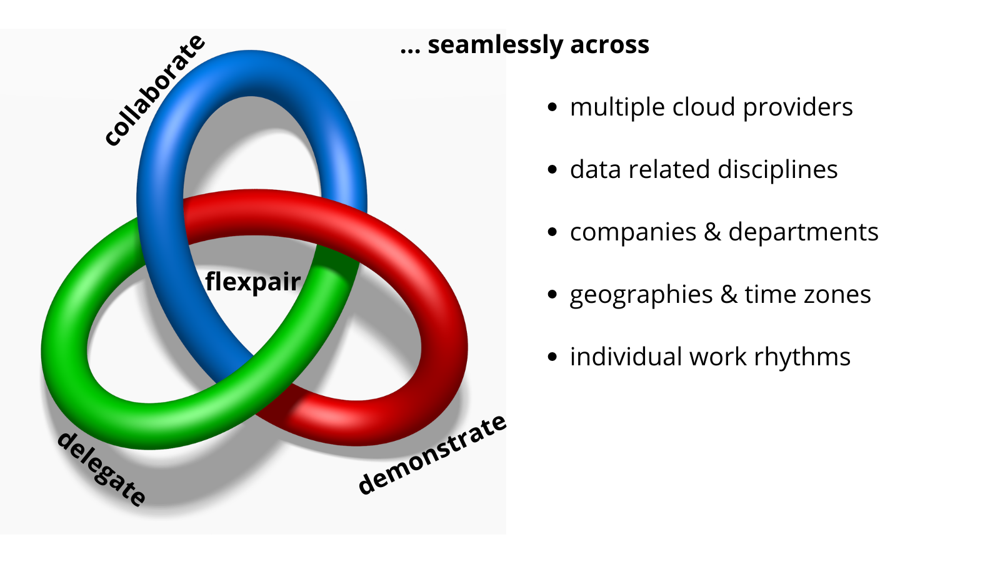

To give you an example: As a manager, you need to fill m project roles involving x cloud providers with n≠m data nerds who work from y locations in z (personal) time zones. You: 😵‍💫 We: 🤗 Don't despair&mdash;flexpair!

With over 8 years of [data science experience](https://de.linkedin.com/in/fielenbach) under our belts, we understand that the success of these projects hinges on efficiently sharing work packages between coworkers before jointly delivering them to the client.

And as more and more companies transition to a hybrid working model, we asked ourselves the question: How can we make those frequent handovers more consistent and a truly hands-on experience?

## Truly interactive wherever you are
- we do not waste valuable bandwidth for stuttering video
- we concentrate on live co-editing and high quality audio
- place your server where your teams has minimum latency

## Fully reproducible work environment
- never ever again hear or say the words "but it worked on my machine"
- clone not only source code but the entire desktop at the press of a button
- quickly onboard new colleagues by skipping the manual setup process 

## Scalable multi-cloud infrastructure
- Infrastructure-as-code controlled from Terraform Cloud and GitHub
- flexibly scale the number of desktops and their compute power up and down
- combine (even free tier) resources from all major cloud providers in one deployment
- automatically receive a dedicated subdomain and team email inbox

## Record and replay handover sessions
- voices as well as sound played on the desktop can be recorded as separate audio tracks
- no need to take notes, fully concentrate on asking the right questions
- participants can decide afterwards to keep or delete their individual tracks
- large video recordings are saved directly in the cloud, instead of cluttering your local disk

## Carbon dioxide and waste reduction
- we go beyond the obvious "less business travel" argument
- no need for a second or third notebook, because Flexpair fully runs in your favorite browser
- Not so fun fact: Did you know that the production of a notebook until you switch it on the first time produces as much CO2 as driving about 1200 km with your car?
- Ubuntu 20.04 LTS with lightweight LXQt desktop requires only 1 GB of RAM (often available for free)

## Inclusion through maximum flexibility
- actively supports synchronous and asynchronous work modes
- Made by neurodiverse people for neurodiverse people
- there is many top talented neurodiverse people out there
- flexible work location

## Personal boundaries and data protection
- Flexpair deliberately does not offer video conferencing. Because remote work should not feel like being a lone wolf in one moment and like Big Brother in the next.
- if you really need to give someone remote access to your local machine, please consider using [TeamViewer](https://www.teamviewer.com/en/) or comparable established solutions.
- full control over which data are stored and where
- a TLS certificate is automatically created and renewed for you
